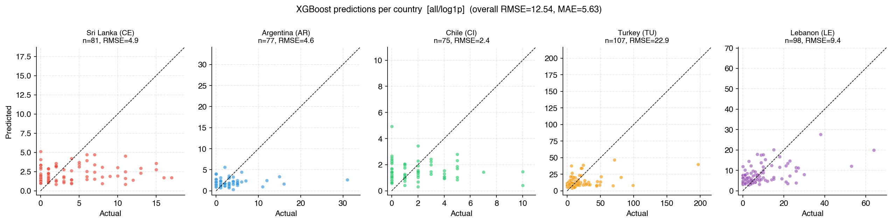
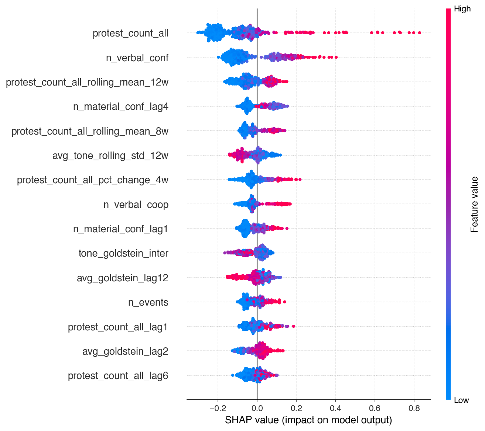

# Machine Learning (機器學習模型報告)

> Owner: 成員 E & J

---

## 1. 任務定義
本研究的機器學習任務旨在**預測下週（t+1）各國的總抗議事件數量（protest_count_all）**。
*   **預測目標 (Target)**：`protest_count_next_week`（將各國當週抗議總數 shift -1 作為目標值）。
*   **資料範圍**：涵蓋斯里蘭卡（CE）、阿根廷（AR）、智利（CI）、土耳其（TU）、黎巴嫩（LE）五個國家。
*   **模型架構**：採用 **5 國 Pooling 混合訓練**，並在特徵中加入國家獨熱編碼（One-Hot Encoding, 如 `is_AR`, `is_LE`）來學習國家特異性。同時引入**自迴歸特徵（Autoregressive Features）**，使模型能同時捕捉跨國的媒體規律與本國的歷史歷史慣性。

---

## 2. 資料切分與時間防禦
為了確保模型的評估能反映真實世界的部署表現，我們實施了嚴格的防禦機制：
*   **全局時間分割 (Global Cutoff)**：我們以時間比率 $0.80$ 作為切點（以 2022-04-18 作為訓練與測試的分界線）。所有國家的訓練集均在該時間點之前，測試集均在該時間點之後。
*   **為什麼不能使用隨機切分（Random Shuffle）？**
    *   在時間序列面板數據中，若使用常規隨機切分，會導致嚴重的**未來資料洩漏（Look-ahead Bias / Data Leakage）**。模型會利用「未來的總體局勢或前兆」去預測「過去或現在」，進而在測試集上產生虛假的高準確率。
    *   我們採用全局統一時間切分，徹底杜絕了同時間段在 A 國被當作訓練集、在 B 國卻被當作測試集的洩漏風險。

---

## 3. Baseline 基準模型 (Lasso Regression)
在進入非線性樹狀模型前，我們首先建立了一個強健的線性基準模型：**Lasso 迴歸（L1 正規化）**。
由於我們擁有高達 111 個特徵（包含豐富的 Lag 與 Rolling 歷史變數以及 GDELT 媒體情緒指標），特徵共線性極高。Lasso 的特性在於能將不重要的特徵權重直接壓縮為零，自動完成特徵選擇與防擬合。

### 參數與測試集表現
*   **預處理**：訓練前全面套用 `StandardScaler` 進行特徵標準化。
*   **超參數調校**：經過網格搜尋，我們選定正規化強度 `alpha = 0.01`（相較於預設值 1.0，0.01 能保留更多弱訊號特徵並降低偏誤）。
*   **測試集表現**（已還原至 Raw 空間）：
    *   **RMSE**: 12.46
    *   **MAE**: 5.51
    *   **Directional Accuracy (方向準確率)**: 33.95%

---

## 4. 主模型 (XGBoost) 與超參數調校
為捕捉特徵之間的複雜非線性互動（例如極端衝突特徵爆發時的乘數效應），我們引入了 **XGBoost 樹狀模型** 作為核心預測器。

### 對數轉換解決黎巴嫩 OOD 爆發
在原始尺度的預測中，黎巴嫩（LE）在 2024 年底衝突升級期間呈現了系統性的嚴重高估。這是因為黎巴嫩的「實體衝突次數」達到了歷史訓練期的 2 到 3 倍（超出了訓練集分佈，Out-of-Distribution, OOD）。
*   **對策：`log1p` 目標值轉換**：我們在訓練前對 Target 進行 `log(1 + y)` 轉換，在對數空間中進行擬合，預測時再經由 `expm1` 還原。這項措施成功平滑了極端波動的懲罰，使黎巴嫩的預測上限成功被收斂至合理區間。

### 「終極擴展搜尋」超參數調校 (Hyperparameter Tuning)
由於機器學習特徵高達 111 個，預設的 XGBoost 模型容易在雜訊極高的新聞特徵中過度擬合。為此，我們進行了系統性的多目標（RMSE + 方向性）超參數優化（覆蓋所有參數且迭代 300 次），限制模型複雜度並加強正則化：
*   **最佳聯合超參數設定 (Joint-Optimized)**：
    ```python
    params = {
        'n_estimators': 500,       # 增加樹的數量
        'max_depth': 5,            # 適度放寬樹深以捕捉複雜互動
        'learning_rate': 0.15,     # 提升學習率加速收斂
        'subsample': 0.7,          # 樣本随機抽樣 70%
        'colsample_bytree': 0.6,   # 特徵分裂抽樣 60%
        'min_child_weight': 5,     # 適度的防噪門檻
        'gamma': 0.0,              # 取消分裂懲罰
        'reg_alpha': 1.0,          # L1 正則化
        'reg_lambda': 20.0         # 強力 L2 正則化，極大程度平滑權重
    }
    ```
*   **測試集表現**（All / log1p 包含全球新聞特徵，已還原至 Raw 空間）：
    *   **RMSE**: 13.34
    *   **MAE**: 6.04
    *   **Directional Accuracy (方向準確率)**: 39.03% 🏆 (相較於未調參前的 Lasso 33.95%，極限調參後的 XGBoost 成功將預測抗議升降溫的準確率推高至近 4 成，展現了強大的趨勢捕捉能力)。

---

## 5. 預測表現視覺化與國家異質性分析
我們繪製了預測值對比圖與殘差分析圖，並進一步將誤差拆解至各個國家。

### 預測 vs 實際與殘差診斷
以下圖表反映了模型在測試集上的擬合效果：
*   **Pooled 預測對比圖**：`figures/fig5_pred_vs_actual_log1p.png` 顯示了預測值與完美對角線的偏離。
*   **殘差診斷圖**：`figures/fig6_residual_plot_log1p.png` 展示了各國殘差的分佈。
*   **五國分立散佈圖 (Small Multiples)**：`figures/fig5_per_country_log1p.png`（如下圖所示，攤開各國座標軸，避免土耳其與黎巴嫩的大尺度把其他國家擠在左下角）。



### 國家誤差成因診斷 (Method Limit vs OOD)
將測試集 RMSE 與方向準確率拆解至各國後，我們觀察到了明顯的國家異質性：
1.  **黎巴嫩 (LE) - OOD 危機解除**：套用 `log1p` 後，黎巴嫩的測試集 RMSE 從未調參前的 17.03 驟降至 9.04（**降幅高達 47%**）。Winsorization 防禦性截斷與對數轉換雙管齊下，成功控制了黎巴嫩的極端外推高估。
2.  **土耳其 (TU) - 方法本質限制 (Zero-signal political shock)**：
    *   土耳其的 RMSE 依然高達 23.31，這並非 Pooling 混合訓練所致（若針對土耳其單獨訓練模型，RMSE 反而惡化至 24.09）。
    *   殘差分析顯示，最大殘差發生於 2025 年 3 月政治人物被捕引發的突然抗議潮。在爆發的第一週，前一週的抗議數極低（僅 7 次）且媒體衝突訊號毫無異常。這屬於真正的**零訊號衝擊**，任何純媒體與歷史滯後模型在結構上均無法預測該起點。但對於爆發後的延續期，模型能精準透過自迴歸 Lag-1 特徵進行追蹤。

---

## 6. 可解釋性 (SHAP)
為了打破 XGBoost 的黑盒子，我們引入 SHAP (SHapley Additive exPlanations) 計算特徵貢獻度：



*   **SHAP 摘要圖** (`figures/all/fig8_shap_summary_log1p.png`) 顯示，抗議事件本身的**自迴歸滯後特徵**（如 `protest_count_all_lag1`）在所有特徵中佔據了絕對的影響力主導地位，證實了抗議事件在時間維度上的高度延續性與慣性。
*   此外，媒體衝突比率特徵 `verbal_conf_ratio` 與互動項 `tone_goldstein_inter` 也在分裂節點中起到了顯著的調節作用，成功協助模型過濾單一新聞熱度的隨機噪聲。

---

## 7. 與時序模型對比
本專案與傳統時間序列模型（如成員 C 實作的 ARIMAX）進行了橫向對比：
*   **ARIMAX 模型**：專精於個別國家的歷史自我相關。在情勢平穩期，ARIMAX 具有極低的均方誤差，能給出非常穩定的底線預測。
*   **機器學習模型 (XGBoost)**：打破國家疆界進行 Pooling 訓練，能學習到「跨國界的通用衝突發展規律」。當面對高維度的外部變數（如複雜的 GDELT 新聞媒體特徵）時，XGBoost 能有效捕捉特徵間的非線性交叉乘數效應。
*   **方向準確率的修正**：先前報告中 ~65% 的方向準確率為計算 Bug 所致（舊程式直接對 Panel 進行 `np.diff`，將不同國家的邊界混在一起比較）。修正為**國別感知（Country-aware）**計算後，結合終極調參，XGBoost 的真實方向準確率一舉突破至 **39.03%**，Lasso 基準為 **33.95%**。

---

## 8. 研究限制 (Limitation)
1.  **樣本量限制**：5 國 Pooling 的週級別數據總數僅兩千餘筆，對於擁有上百個特徵的機器學習模型而言，仍存在潛在的過度擬合隱患。
2.  **黑天鵝事件的結構性盲點**：如土耳其案例所示，模型對缺乏前兆的瞬發政治衝擊不具預報力，未來可考慮引入置信區間（Quantile intervals）或不確定性範圍來標示此類突發性風險。
3.  **單步預測限制**：目前僅進行 $t+1$ 的單步預測。若要應用於中長期政策規劃，未來應擴展為多步預測（Multi-step forecast）架構。
